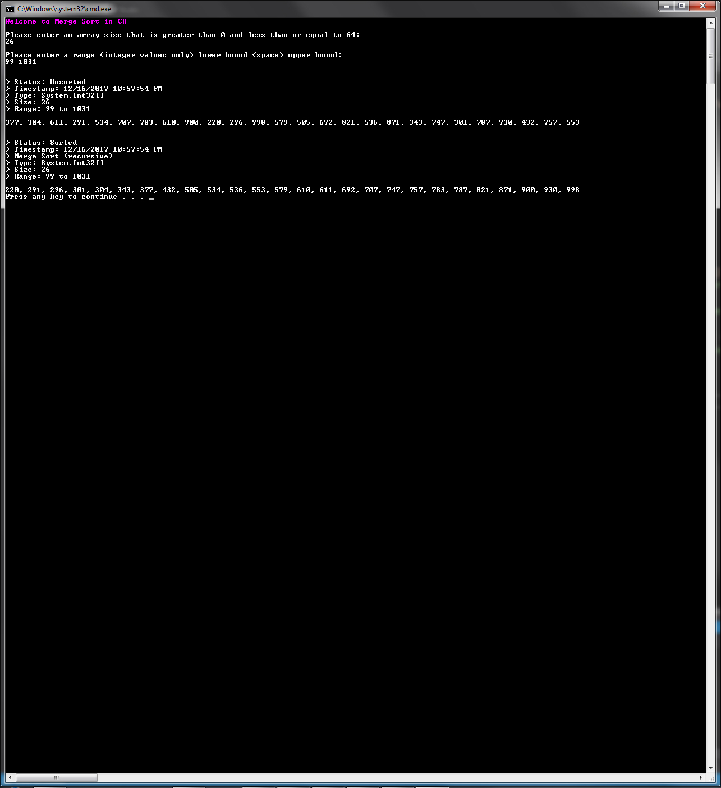
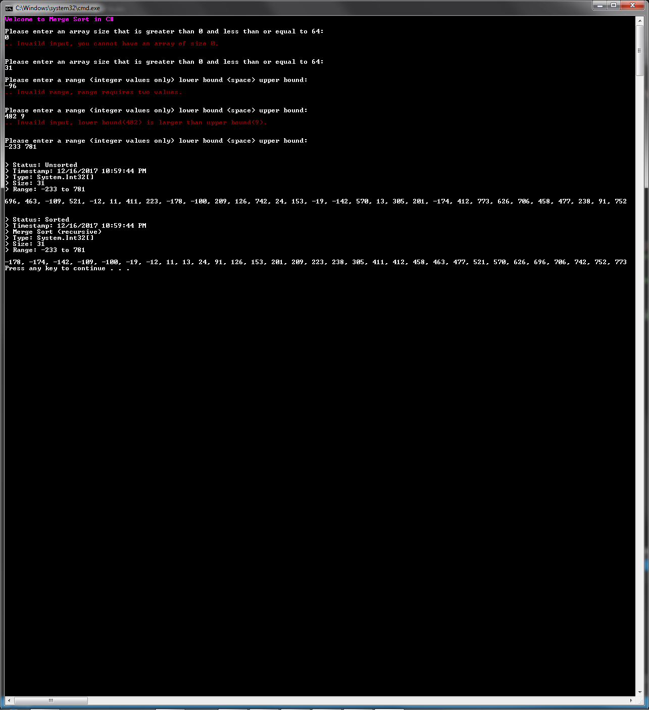

# Merge Sort in C# .NET 
This is the merge sort algorithm written in the C# programming language within the .Net framework. This implementation uses recursion via static methods that are encapsulated in a class. In addition, a driver application is included for demonstration purposes.

## Algorithmic efficiency
* The time complexity is order of n log n.

## Screenshot(s)

## Built with
* Microsoft Visual Studio 2017
* Microsoft Visual C# Compiler version 2.6.0.62329 (5429b35d)

## Author
* **Jarid Bredemeier**

## License
Apache license 2.0