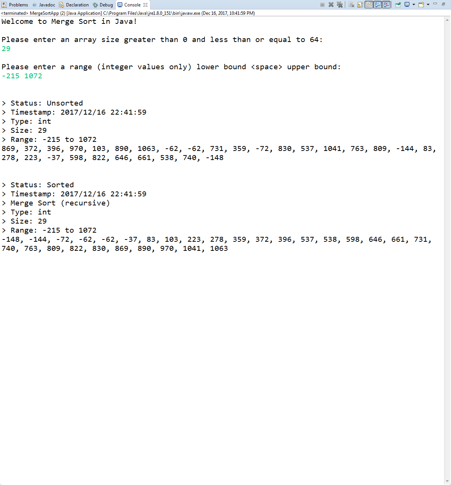
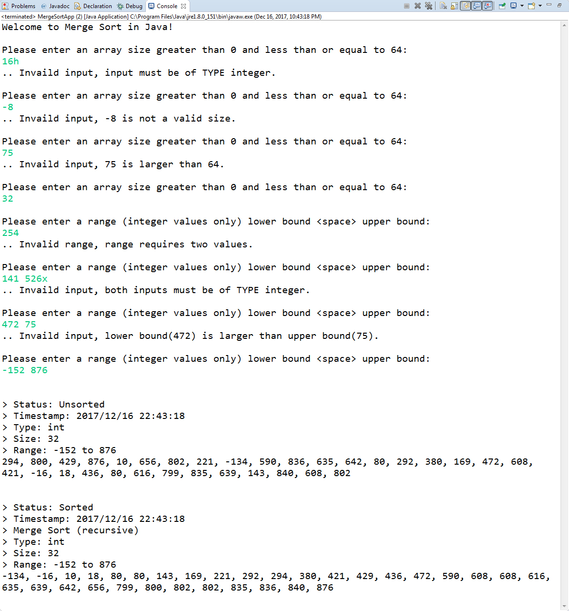

# Merge Sort in Java 
This is the merge sort algorithm written in the Java programming language. This implementation uses recursion via static methods that are encapsulated in a class. In addition, a driver application is included for demonstration purposes.

## Algorithmic efficiency
* The time complexity is order of n log n.

## Screenshot(s)

## Built with
* Java version "1.8.0_151"
* Java(TM) SE Runtime Environment (build 1.8.0_151-b12)
* Java HotSpot(TM) 64-Bit Server VM (build 25.151-b12, mixed mode)
* Eclipse Oxygen Release (4.7.1a)

## Author
* **Jarid Bredemeier**

## License
Apache license 2.0